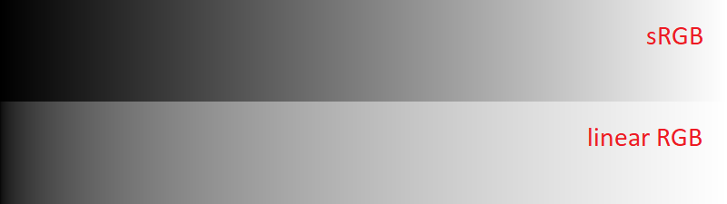

# Color Utilities

There are two color spaces you should know about when working with threedee: linear RGB and sRGB.

In the above image, both gradients' values vary linearly from 0 to 1 as you go from left to right. The top gradient interprets these values in the sRGB color space, and the bottom gradient interprets these values in the linear RGB color space.

In the linear sRGB color space, the colors' numeric values are linearly proportional to the physical amount of light emitted. For example, a 50% gray in linear space would physically emit half as much light as white. However, we do not perceive light linearly; if you look at the above image, a 50% gray in linear space "looks" much closer to white than to black. You can see that most of the range is dedicated to very light shades of gray, which seems like quite the waste.

Thus, you'll find that most common image formats, paint programs, etc. represent colors in the sRGB color space. This space is much more "perceptually linear"; a 50% gray in sRGB looks much more like a mid-way value between black and white. Your monitor then converts sRGB colors to linear values by raising the values to the power of 2.2 (or something similar), a process known as gamma correction.

In threedee, you'll find many properties that take in colors in the form of a Vec3. To simplify internal calculations, these Vec3s should represent colors in the *linear RGB* color space. threedee provides some utility functions for converting sRGB color values to linear, so that you can e.g. directly use numeric values color-picked from your art program. These utilities are provided in the `td.color` table.

#### `color.linrgb(r: number, g: number, b: number): Vec3`

Creates a Vec3 representing the given linear RGB color.
`r`, `g`, and `b` should each range from 0 to 1.
Equivalent to `Vec3:new(r, g, b)`.

#### `color.srgb(r: number, g: number, b: number): Vec3`

Creates a Vec3 representing the given sRGB color.
`r`, `g`, and `b` should each range from 0 to 1.
Equivalent to `Vec3:new(r ^ 2.2, g ^ 2.2, b ^ 2.2)`.

#### `color(r: number, g: number, b: number): Vec3`

You can also call the `color` table itself directly like a function.
This is equivalent to `color.srgb(r, g, b)`.